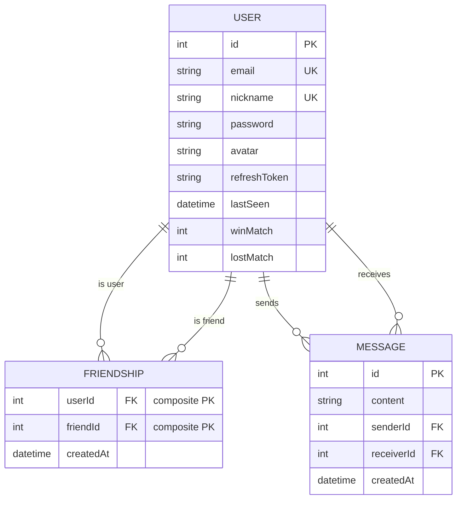

*This project has been created as part of the 42 curriculum by lle-tuto, mafourni, csolari, eel-abed, lsadon--.*

# ft\_transcendence — Rock Paper Scissors

## Description

ft\_transcendence is a full-stack, real-time multiplayer web platform built around a Rock-Paper-Scissors game. Players authenticate securely, manage a profile, add friends, chat in real time, play against a trained bot and play live matches against each other over WebSockets — with bonus moves added on top of the classic Rock/Paper/Scissors rules. The platform also includes an AI-powered assistant that can answer questions about the project using a RAG (Retrieval-Augmented Generation) pipeline.

### Key features

* Secure authentication: email/password signup & login, JWT access tokens + rotating refresh tokens, optional TOTP-based Two-Factor Authentication (QR code setup)

* Real-time multiplayer Rock-Paper-Scissors with multiple game levels, bonus moves, and reconnection handling

* Game in 3D environment with animations

* An AI opponent that predicts the player's next move (order-1 Markov chain + win-stay/lose-shift + frequency analysis), plays its counter, adapts to the score, and keeps human-like, imperfect play via controlled randomness

* User profiles with avatar upload, nicknames, and online status

* Friends system (add/remove, friends list)

* Real-time private chat between users

* Match history and win/loss statistics

* AI chatbot answering questions about the project via a RAG pipeline (LangChain + in-memory vector store)

* Privacy Policy and Terms of Service pages

## Instructions

### Prerequisites

* Docker and Docker Compose

* `make`

* `openssl` (used by `make` to generate local self-signed TLS certificates if they don't already exist)

### Configuration

1. Copy `back/.env.example` to `back/.env`.
2. Fill in the following variables:

   * `POSTGRES_USER`, `POSTGRES_PASSWORD`, `POSTGRES_DB` — database credentials

   * `DATABASE_URL` — connection string used by the backend container (host: `db`)

   * `LOCAL_DATABASE_URL` — connection string for local tools (e.g. Prisma Studio) via `localhost`

   * `JWT_SECRET`, `REFRESH_SECRET` — random secret strings (e.g. generated with `openssl rand -hex 32`)

   * `NEXT_PUBLIC_DEV_HOST` — the IP address/hostname of the machine running the project, so the frontend can be reached over the network

### Running the project

From the repository root:

* `make up` — generates self-signed TLS certificates (if missing), then builds and starts all services: PostgreSQL (with the pgvector extension), the NestJS backend, the Next.js frontend, and the nginx reverse proxy.

* The app is served at **<https://localhost:8443>** (the browser will warn about the self-signed certificate — this is expected in local development).

* `make down` — stop all containers.

* `make logs` — follow combined container logs.

* `make fclean` — full reset (removes containers, volumes, generated certs, and caches).

* `make re` — equivalent to `fclean` followed by `up`.

Ports 3000 (backend), 3001 (frontend), 5432 (PostgreSQL) and 5555 (Prisma Studio) are also exposed directly for debugging, but normal usage should always go through nginx, since the backend expects requests under the `/api/` prefix that nginx strips before forwarding.

## Resources

* [NestJS documentation](https://docs.nestjs.com)

* [Next.js documentation](https://nextjs.org/docs)

* [Prisma documentation](https://www.prisma.io/docs)

* [Socket.IO documentation](https://socket.io/docs/v4/)

* [LangChain.js documentation](https://js.langchain.com/docs/)

* [pgvector](https://github.com/pgvector/pgvector)

* [otplib (TOTP/2FA)](https://github.com/yeojz/otplib)

* [JWT introduction](https://jwt.io/introduction)

* [Three.js documentation](https://threejs.org/docs/)

* [React documentation](https://react.dev/learn)

* youtube tutos on Blender

### How AI was used

* Backend authentication & WebSocket game module: AI (Claude) was used as a learning tool — concepts were explained before any code was written, code was written by hand and reviewed/corrected rather than generated, and it helped debug specific issues. It was also used to generate internal markdown documentation for the team.

* Implementation of the game with a 3D environment and animations: AI (Gemini) was used to facilitate the application of in-house logic and design to the game’s various levels: the interface for two levels was designed manually, while the others were structured on the same basis by Gemini. The AI saved time on this repetitive task. It was also used to make certain error messages easier to understand and to facilitate debugging.

* Frontend : Claude and Mistral were used to understand how JavaScript XML syntax looks and works. It was helped as a tool to develop more complicated css effects such as the turning circle on the welcome page. It also helped with understanding potential security errors and testing the access to protected pages.

* AI (Claude) was used as a pair-programming and learning tool. NestJS concepts (modules, services, controllers, WebSocket gateways, dependency injection) and React hooks were explained.It was especially helpful for debugging real-time issues — WebSocket authentication over a self-signed HTTPS certificate and cookie handling on socket handshakes — and for understanding Prisma relations and migrations.

## Team Information

### Members

| Member   | Login    | Role(s)         | Responsibilities                                                                                                     |   |
| -------- | -------- | --------------- | -------------------------------------------------------------------------------------------------------------------- | ------ |
| Lenny    | lsadon-- | Technical Lead  | Backend authentication system (JWT, refresh tokens, 2FA) and WebSocket game module                                   |   |
| Maxence  | mafourni | Developer       | AI chatbot / RAG pipeline, AI opponent (predictive bot)                                                              |   |
| Elias    | eel-abed | Developer       | Database & Prisma schema, user management (profile, avatar), friends system, online presence, real-time private chat |   |
| Lena     | lle-tuto | Product Owner   | Frontend (Next.js), game module (front integration)                                                                  |   |
| Capucine | csolari  | Project Manager | 3D modeling and implementation, Frontend(Three.js, Next.js)                                                          |   |

### Project Management

* Task organization: Notion

* Tools used: Notion

* Communication channels: WhatsApp / discord

* Meeting cadence: 1/2 a week

## Technical Stack

* **Frontend:** Next.js (React), Tailwind CSS, Framer Motion (animations), React Three Fiber / drei + Three.js (3D rendering for the game), Socket.IO client
  * Next.js — SSR, routing, and API routes in one React project,less manual config needed.
  * Framer Motion — Declarative animation API that integrates cleanly into React without extra setup.
  * React Three Fiber / drei / Three.js — Renders the 3D game inside the React tree, keeping one unified render cycle instead of managing a raw canvas alongside React.

* **Backend:** NestJS, Socket.IO (WebSocket gateways),  class-validator/class-transformer (DTO validation), bcrypt (password hashing), otplib + qrcode (2FA)
  * NestJS — Modular, decorator-driven architecture that scales well across a team; each feature lives in its own module.
  * Socket.IO client — Pairs directly with the NestJS gateway for real-time game events.
  * class-validator / class-transformer — Declarative DTO validation with zero manual parsing code. 
  * bcrypt — Industry standard for password hashing, no justification needed.
  * otplib + qrcode — Handles TOTP-based 2FA (Google Authenticator compatible) without a third-party service.

* **Database:** PostgreSQL (running the pgvector image), accessed through Prisma ORM
  * PostgreSQL + pgvector — Solid relational DB extended with vector columns, so no separate vector database is needed for RAG.
  * Prisma ORM — Schema-first with generated TypeScript types, eliminating drift between the DB model and application code.

* **AI / RAG:** LangChain, an in-memory vector store, Ollama (`nomic-embed-text`) for embeddings and Groq (`llama-3.3-70b`) as the LLM backend
  * LangChain — Orchestrates the retrieval → prompt → response chain without manual wiring
  * In-memory vector store — Sufficient for a school project where vector persistence across restarts isn't required.
  * Ollama (nomic-embed-text) — Runs embeddings locally, avoiding API costs and external latency.   
  * Groq (llama-3.3-70b) — Fast inference on a capable open model, free tier covers school-project usage.

* **Infrastructure:** Docker Compose, nginx (reverse proxy + TLS termination, strips the `/api/` prefix before forwarding to the backend)
  * Docker Compose — One command spins up every service consistently across all team members' machines. 
  * nginx — Handles TLS termination and /api/ prefix stripping in one place, keeping backend routes clean.

## Database Schema

* **User** — account info (email, nickname, hashed password, avatar, last seen, win/loss counters), optional OAuth fields

* **Friendship** — many-to-many self-relation on `User` (`userId` ↔ `friendId`), used for the friends list

* **Message** — private chat messages, linked to a sender and a receiver `User`

* Win/loss stats are tracked directly on `User` (`winMatch` / `lostMatch`) and shown on the profile

* The RAG chatbot's document chunks and their embeddings are **not** stored in the database: they are loaded from the `docs/` folder and held in an in-memory vector store, rebuilt at backend startup

## Features List

| Feature               | Description                                                            | Contributor(s)         |
| --------------------- | ---------------------------------------------------------------------- | ---------------------- |
| Authentication        | Signup/login, JWT + refresh token rotation, httpOnly cookies           | Lenny                  |
| 2FA                   | TOTP-based two-factor authentication with QR code setup                | Lenny                  |
| Real-time RPS game    | WebSocket-based matches, rooms, reconnection                           | Lenny                  |
| AI opponent           | Predictive bot (Markov + win-stay/lose-shift + frequency), plays the counter, score-adaptive, human-like randomness | Maxence                |
| Profile & avatar      | View/edit profile, upload avatar                                       | Elias                  |
| Friends               | Add/remove friends, friends list, online status                        | Elias                  |
| Chat                  | Real-time private messaging                                            | Elias                  |
| Public profile pages  | View any user's public profile (avatar, online status, stats, friends) | Elias                  |
| Match history & stats | Win/loss tracking per user                                             | Lenny / Lena / Maxence |
| AI chatbot (RAG)      | Answers questions using project documentation                          | Maxence                |
| Privacy Policy / ToS  | Static informational pages                                             | Lena                   |
| 3D Implementation     | Implementation of 3D in our game using tree.js                         | Capucine               |
| Front                 | Connect the front and the back                                         | Lena / Capucine        |
|                  |                                                                   |                   |

## Modules

Draft estimate based on the current codebase, since only modules that work during the evaluation demo count.

| Category                | Module                                          | Type  | Points | Status |
| ----------------------- | ----------------------------------------------- | ----- | ------ | ------ |
| Web                     | Frontend + backend framework (Next.js + NestJS) | Major | 2      | ✅      |
| Web                     | Real-time features (WebSockets)                 | Major | 2      | ✅      |
| Web                     | User interaction (chat + profile + friends)     | Major | 2      | ✅      |
| Web                     | ORM (Prisma)                                    | Minor | 1      | ✅      |
| User Management         | Standard user management                        | Major | 2      | ✅      |
| User Management         | Game stats & match history                      | Minor | 1      | ✅      |
| User Management         | 2FA                                             | Minor | 1      | ✅      |
| Artificial Intelligence | RAG system                                      | Major | 2      | ✅      |
| Artificial Intelligence | AI opponent                                     | Major | 2      | ✅      |
| Gaming and UX           | Web-based multiplayer game                      | Major | 2      | ✅      |
| Gaming and UX           | Remote players                                  | Major | 2      | ✅      |
| 3D                      | Implementation of 3D                            | Major | 2      | ✅      |

**Justification for module choices:**
We agreed to organize our work around a web-based game app. Everyone was interested in learning activities that could be structured around this app.
About 3D and front design, we wanted a visually striking website. Form changes how we perceive content. Also Capucine was very curious to learn about 3D.
Maxence was interested in AI.

## Individual Contributions

* **Lenny: (auth & WebSocket game module):** Backend authentication (JWT, refresh token rotation, httpOnly cookies, 2FA), WebSocket game gateway (rooms, reconnection logic, scoring).

* **Maxence:** AI chatbot / RAG pipeline (LangChain, in-memory vector store, Ollama embeddings + Groq LLM, document loading & indexing at startup), and the AI opponent — a client-side predictive bot that anticipates the player's next move (order-1 Markov chain combined with win-stay/lose-shift and frequency analysis), plays the counter, adapts its aggressiveness to the score, and stays human-like through controlled randomness.

* **Elias:** Database design and Prisma setup (User, Friendship and Message models + migrations), user management (profile view/edit, password re-hashing, avatar upload), friends system (add/remove, search by nickname, friends list), online/offline presence (login/logout based), real-time private chat (REST history endpoint + WebSocket gateway + frontend page), and public profile pages with match statistics.

* **Lena:** Frontend (Next.js) structure and integration.

* **Capucine:** Game design, 3D creation and implementation (Three.js, Next.js), link back and front for multiplayergame.

## Challenges faced and how they were overcome:

Lenny: The main challenge for me was to learn a new language and a new environment. It is a lot different of what i am used to. It's not algorithmic code but  more imbrication of little part which are already coded. So it was a lot of the information and new concept to learn.

Capucine: My main challenge was learning how to create animations. I had never worked with Blender before. I learned all the steps involved in 3D design, from creating a simple object to designing a character, including “cloud ringing,” “weight painting,” animation, and setting up the camera and lighting. I then learned how to integrate these elements into the user interface using Three.js, where I had to recreate certain elements such as the lighting and the camera. Every step of my contribution to this collaborative project was a new discovery for me. There were many behind-the-scenes steps involved in achieving the final result implemented in the project. I didn't realize it would take this long to complete this part from scratch.
E

lias: By far my biggest challenge was working with WebSockets and real-time communication. Building the online/offline presence and the private chat meant understanding how a socket connection authenticates, how the server keeps track of who is connected, and how it pushes events to the right user in real time — a completely different model from the usual request/response I was used to. The worst part was getting WebSockets to work behind a self-signed HTTPS certificate: the browser silently blocked the socket connection and the auth cookie wasn't being sent on the handshake, which took hours of debugging to track down. Compared to that, picking up the rest of the stack (TypeScript, NestJS and Prisma) and the frontend felt much more manageable.

Maxence: My main challenge was learning two new languages, JavaScript and TypeScript, coming from a very different background. On top of that, I had to do some frontend work for the first time, building the chatbot button and its interface, which was completely new to me. The hardest part was the AI chatbot itself: understanding how a RAG pipeline works (embeddings, vector similarity, retrieval) and wiring together LangChain, a local Ollama model for embeddings and a Groq LLM for generation. Learning the NestJS backend architecture (dependency injection, modules, guards) alongside all of this was a lot of new concepts to absorb at once.

Lena: Learning new languages and also a new way to work was very challenging. The logic of working with frontend is very different that what I had done before. Although it can feel more rewarding to code something that you can usually immediately see it also can be tricky to be aware of the “invisible” things that still need to be done.
